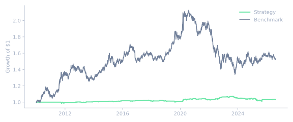
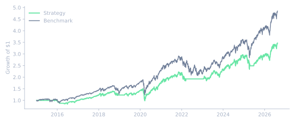
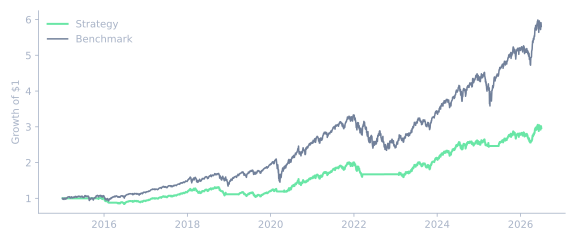

<section class="la-hero" markdown="1">

Systematic research, fully documented

# Real backtests. Honest outcomes.

LazyAlpha is research infrastructure, not an execution system or investment advice. This site documents its real backtested strategy research with context, cited sources, and full results. Failed and inconclusive results appear just as prominently as passing ones.

  <a class="la-btn la-btn--primary" href="leaderboard/">Explore every result →</a>
  <a class="la-btn la-btn--secondary" href="methodology/">Read the methodology</a>

</section>

<!-- STATS:START -->

  
17Experiments documented

  
3Walk-forward PASS

  
13FAIL

  
1NOT EVALUABLE

<!-- STATS:END -->

  Evidence, immediately
  <h2>Passing results, with the curves attached.</h2>
  
These are the real growth-of-$1 time series supplied with the source runs. Open any record for its parameters, provenance, full metrics, and walk-forward judgment.

<!-- FEATURED_CHARTS:START -->

<article class="la-featured-card">

Walk-forward result
<h3><a href="models/cointegration-pairs-tlt-ief/#variant-1">cointegration_pairs_tlt_ief</a></h3>

PASS

<figure class="la-chart la-chart--equity la-chart--compact" data-chart-kind="equity">
  
Equity time series

  
  <figcaption>Real growth-of-$1 series · strategy vs benchmark</figcaption>
</figure>
<a class="la-card-link" href="models/cointegration-pairs-tlt-ief/#variant-1">Inspect evidence →</a>
</article>
<article class="la-featured-card">

Walk-forward result
<h3><a href="models/ma-crossover-50-200/#variant-1">ma_crossover_50_200</a></h3>

PASS

<figure class="la-chart la-chart--equity la-chart--compact" data-chart-kind="equity">
  
Equity time series

  
  <figcaption>Real growth-of-$1 series · strategy vs benchmark</figcaption>
</figure>
<a class="la-card-link" href="models/ma-crossover-50-200/#variant-1">Inspect evidence →</a>
</article>
<article class="la-featured-card">

Walk-forward result
<h3><a href="models/vix-term-structure-gated-ma-50-200/#variant-1">vix_term_structure_gated_ma_50_200</a></h3>

PASS

<figure class="la-chart la-chart--equity la-chart--compact" data-chart-kind="equity">
  
Equity time series

  
  <figcaption>Real growth-of-$1 series · strategy vs benchmark</figcaption>
</figure>
<a class="la-card-link" href="models/vix-term-structure-gated-ma-50-200/#variant-1">Inspect evidence →</a>
</article>

<!-- FEATURED_CHARTS:END -->

## Research without a highlight reel

Read the [Methodology](methodology.md) for the verdict definitions, backtest conventions, and honest-reporting standard applied throughout this site.

Compare every documented strategy variant on the [Leaderboard](leaderboard.md) (individual model pages are listed under "Models" in the navigation), follow the [Changelog](changelog.md) for LazyAlpha's own append-only experiment registry, or read the [Research notes](notes.md) for comparative write-ups that don't fit a single model card.

