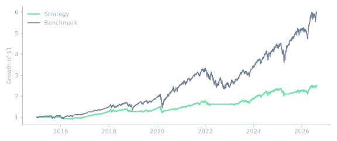
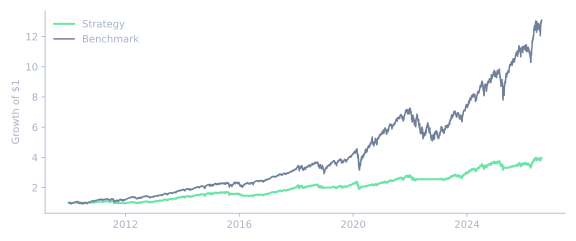

# Strategy: volatility_managed_ma_crossover_50_200

2 variant(s) documented · earliest 2026-09-11 · latest 2026-09-11.

| Variant | Generated | Registered | Verdict |
|---|---|---:|---|
| <a href="#variant-1" title="fast=50, slow=200, volatility_lookback=126, target_annual_vol=0.12, max_leverage=1.0"><code>fast=50, slow=200, volatility_lookback=126, target_annual_vol=0.12, max_leverag…</code></a> | 2026-09-11T20:49:34+00:00 | ✓ | FAIL |
| <a href="#variant-2" title="fast=50, slow=200, volatility_lookback=126, target_annual_vol=0.12, max_leverage=1.0"><code>fast=50, slow=200, volatility_lookback=126, target_annual_vol=0.12, max_leverag…</code></a> | 2026-09-11T23:01:08+00:00 | ✓ | FAIL |

### Variant 1 {: #variant-1 }

**Generated:** 2026-09-11T20:49:34+00:00  
**Source report:** `20260911_204934_volatility_managed_ma_crossover_50_200.md`  
**Registered:** ✓ — 2026-09-11T20:49:34+00:00 (walk_forward_passed=False)

FAIL

#### Experiment

- Period: 2015-01-02 to 2026-08-14 (2921 sessions)
- Execution rule: close-derived weights are applied one session later
- Transaction costs: 5.00 bps per unit of turnover
- Cash return: 0%; taxes, slippage and market impact: not modeled
- Parameters: fast=50, slow=200, volatility_lookback=126, target_annual_vol=0.12, max_leverage=1.0

#### Frozen volatility-management parameters

- Trailing realized-volatility lookback: 126 trading-day returns (six months). This exactly matches Barroso and Santa-Clara (2015) and was not tuned on this run.
- Target annualized volatility: 12.00%. This is the paper's round, conventional risk target, fixed before observing this run rather than selected to maximize its results.
- Maximum leverage: 1.00x of the existing MA allocation. This conservative retail-ETF cap permits only de-risking and never levering above the ungated strategy's allocation.
- Missing-history rule: exposure is explicitly zero until all trailing daily returns required by the volatility lookback exist; no volatility or position weight is imputed.
- Overlay rule: the existing MA trend direction and equal-weight active allocation are unchanged; each active allocation is multiplied by `min(max_leverage, target_annual_vol / trailing_realized_vol)`.

#### Data provenance

- Source: `market-data-hub` (`adj_close`; live rows included: `False`)
- Requested symbols: SPY, QQQ
- Validated common panel: 2015-01-02 to 2026-08-14; 2921 rows
- Database: `C:\Users\Administrator\Documents\GitHub\market-data-hub\market_data.duckdb`

| Symbol | Last date | Status | Coverage score | Stalled |
|---|---:|---|---:|---|
| QQQ | 2026-08-14 00:00:00 | ok | 97.31 | False |
| SPY | 2026-08-14 00:00:00 | ok | 97.33 | False |

#### Research rationale

Scaling down an active 50/200 moving-average allocation when its recent realized volatility is high may reduce crash exposure and improve risk-adjusted returns without changing the trend signal.

Reuse the existing 50/200 MA direction and equal-weight active allocation unchanged. For each ETF with an active allocation, multiply that allocation by min(1.0, 12% / its annualized realized volatility over the trailing 126 daily returns). Hold cash until the complete volatility window exists.

Sources:

- [Barroso, P. and Santa-Clara, P. (2015), "Momentum has its moments", Journal of Financial Economics, 116(1), 111-120.](https://doi.org/10.1016/j.jfineco.2014.11.010) — Scaling a momentum/trend strategy's exposure by the inverse of its own trailing 6-month realized volatility, targeting a constant volatility level, took the (unmanaged) strategy's Sharpe ratio from 0.53 to 0.97 and "virtually eliminated" crashes -- volatility risk is itself predictable by recent realized volatility, and high recent volatility predicts poor subsequent returns, which is exactly what scaling down in high-vol periods avoids. Also available on IDEAS/RePEc: https://ideas.repec.org/a/eee/jfinec/v116y2015i1p111-120.html
- [Hurst, B., Ooi, Y.H. and Pedersen, L.H. (2017), "A Century of Evidence on Trend-Following Investing", Journal of Portfolio Management, 44(1), 15-29.](https://www.aqr.com/Insights/Research/Journal-Article/A-Century-of-Evidence-on-Trend-Following-Investing) — Time-series trend-following delivered positive average returns in every decade since 1880 across markets (average Sharpe ~0.4) and performed well in 8 of the 10 largest drawdown periods for a 60/40 portfolio over the last century -- i.e. trend-following's edge shows up especially in crisis/high-volatility periods, which is exactly when a volatility-scaling overlay reduces exposure, making the two ideas complementary rather than in tension.

Known risks:

- scaling down can sacrifice returns when a profitable crisis trend coincides with high realized volatility
- realized volatility can change faster than a six-month estimator
- the unlevered cap prevents calm-period risk normalization upward
- cash return is modeled as zero and execution frictions are incomplete
- one historical sample is not evidence of future profitability

#### Net backtest metrics

| Metric | Strategy | Ungated MA | Benchmark |
|---|---:|---:|---:|
| Cumulative return | 151.45% | 318.82% | 500.62% |
| CAGR | 8.28% | 13.15% | 16.73% |
| Annualized volatility | 11.20% | 16.74% | 19.44% |
| Annualized Sharpe (rf=0) | 0.77 | 0.82 | 0.89 |
| Maximum drawdown | -20.44% | -30.86% | -30.86% |
| Annualized turnover | 176.26% | 189.80% | 8.63% |
| Transaction-cost drag (sum of daily rates) | 1.02% | 1.10% | 0.05% |

#### Walk-forward / out-of-sample validation

Parameters were frozen before the chronological split. Each window is non-overlapping and backtested independently.

| Window | Role | Period | Sessions | Return | CAGR | Volatility | Sharpe | Max drawdown | Benchmark return | Benchmark Sharpe | Return delta | Sharpe delta |
|---|---|---|---:|---:|---:|---:|---:|---:|---:|---:|---:|---:|
| development | development | 2015-01-02 to 2021-12-15 | 1752 | 75.40% | 8.42% | 11.06% | 0.79 | -20.44% | 227.51% | 1.00 | -152.11% | -0.21 |
| oos_1 | out_of_sample | 2021-12-16 to 2026-08-14 | 1169 | 55.80% | 10.03% | 10.64% | 0.95 | -15.30% | 86.52% | 0.77 | -30.71% | 0.18 |

Pass criterion: in every OOS window, strategy cumulative return and annualized Sharpe must each be at least the corresponding benchmark value.

**Walk-forward verdict: FAIL: degrades out of sample; the frozen strategy trails the benchmark on return or Sharpe in at least one OOS window.**

#### Giudizio / conclusion

**Full-sample comparison: FAIL on this sample: lower net return and Sharpe than the benchmark.**

**Final validation judgment: FAIL: degrades out of sample; the frozen strategy trails the benchmark on return or Sharpe in at least one OOS window.**

This remains historical research, not evidence of tradability or a recommendation. Promotion still requires parameter-robustness and multiple-testing checks plus a live paper period.

#### Ecosystem review

- **LazyFin:** Do not recreate hierarchical portfolio optimization in LazyAlpha; the line was moved/retired from LazyFin and belongs to LazyPortfolio. (`C:\Users\Administrator\Documents\GitHub\LazyFin\docs\status.md`)
- **investmentcommittee:** Keep B0/P0/Sa/PH/PF as methodological reference: same data, folds, costs and rebalance rules for honest comparisons; do not clone it 1:1. (`C:\Users\Administrator\Documents\GitHub\investment-process-top-down-etf.md`)

### Variant 2 {: #variant-2 }

**Generated:** 2026-09-11T23:01:08+00:00  
**Source report:** `20260911_230108_volatility_managed_ma_crossover_50_200.md`  
**Registered:** ✓ — 2026-09-11T23:01:38+00:00 (walk_forward_passed=False)

FAIL

#### Experiment

- Period: 2010-01-04 to 2026-08-14 (4179 sessions)
- Execution rule: close-derived weights are applied one session later
- Transaction costs: 5.00 bps per unit of turnover
- Cash return: 0%; taxes, slippage and market impact: not modeled
- Parameters: fast=50, slow=200, volatility_lookback=126, target_annual_vol=0.12, max_leverage=1.0

#### Frozen volatility-management parameters

- Trailing realized-volatility lookback: 126 trading-day returns (six months). This exactly matches Barroso and Santa-Clara (2015) and was not tuned on this run.
- Target annualized volatility: 12.00%. This is the paper's round, conventional risk target, fixed before observing this run rather than selected to maximize its results.
- Maximum leverage: 1.00x of the existing MA allocation. This conservative retail-ETF cap permits only de-risking and never levering above the ungated strategy's allocation.
- Missing-history rule: exposure is explicitly zero until all trailing daily returns required by the volatility lookback exist; no volatility or position weight is imputed.
- Overlay rule: the existing MA trend direction and equal-weight active allocation are unchanged; each active allocation is multiplied by `min(max_leverage, target_annual_vol / trailing_realized_vol)`.

#### Data provenance

- Source: `market-data-hub` (`adj_close`; live rows included: `False`)
- Requested symbols: SPY, QQQ
- Validated common panel: 2010-01-04 to 2026-08-14; 4179 rows
- Database: `C:\Users\Administrator\Documents\GitHub\market-data-hub\market_data.duckdb`

| Symbol | Last date | Status | Coverage score | Stalled |
|---|---:|---|---:|---|
| QQQ | 2026-08-14 00:00:00 | ok | 97.31 | False |
| SPY | 2026-08-14 00:00:00 | ok | 97.33 | False |

#### Research rationale

Scaling down an active 50/200 moving-average allocation when its recent realized volatility is high may reduce crash exposure and improve risk-adjusted returns without changing the trend signal.

Reuse the existing 50/200 MA direction and equal-weight active allocation unchanged. For each ETF with an active allocation, multiply that allocation by min(1.0, 12% / its annualized realized volatility over the trailing 126 daily returns). Hold cash until the complete volatility window exists.

Sources:

- [Barroso, P. and Santa-Clara, P. (2015), "Momentum has its moments", Journal of Financial Economics, 116(1), 111-120.](https://doi.org/10.1016/j.jfineco.2014.11.010) — Scaling a momentum/trend strategy's exposure by the inverse of its own trailing 6-month realized volatility, targeting a constant volatility level, took the (unmanaged) strategy's Sharpe ratio from 0.53 to 0.97 and "virtually eliminated" crashes -- volatility risk is itself predictable by recent realized volatility, and high recent volatility predicts poor subsequent returns, which is exactly what scaling down in high-vol periods avoids. Also available on IDEAS/RePEc: https://ideas.repec.org/a/eee/jfinec/v116y2015i1p111-120.html
- [Hurst, B., Ooi, Y.H. and Pedersen, L.H. (2017), "A Century of Evidence on Trend-Following Investing", Journal of Portfolio Management, 44(1), 15-29.](https://www.aqr.com/Insights/Research/Journal-Article/A-Century-of-Evidence-on-Trend-Following-Investing) — Time-series trend-following delivered positive average returns in every decade since 1880 across markets (average Sharpe ~0.4) and performed well in 8 of the 10 largest drawdown periods for a 60/40 portfolio over the last century -- i.e. trend-following's edge shows up especially in crisis/high-volatility periods, which is exactly when a volatility-scaling overlay reduces exposure, making the two ideas complementary rather than in tension.

Known risks:

- scaling down can sacrifice returns when a profitable crisis trend coincides with high realized volatility
- realized volatility can change faster than a six-month estimator
- the unlevered cap prevents calm-period risk normalization upward
- cash return is modeled as zero and execution frictions are incomplete
- one historical sample is not evidence of future profitability

#### Net backtest metrics

| Metric | Strategy | Ungated MA | Benchmark |
|---|---:|---:|---:|
| Cumulative return | 297.79% | 633.33% | 1207.31% |
| CAGR | 8.68% | 12.77% | 16.77% |
| Annualized volatility | 11.37% | 16.03% | 18.56% |
| Annualized Sharpe (rf=0) | 0.79 | 0.83 | 0.93 |
| Maximum drawdown | -20.44% | -30.86% | -30.86% |
| Annualized turnover | 184.19% | 186.93% | 6.03% |
| Transaction-cost drag (sum of daily rates) | 1.53% | 1.55% | 0.05% |

#### Walk-forward / out-of-sample validation

Parameters were frozen before the chronological split. Each window is non-overlapping and backtested independently.

| Window | Role | Period | Sessions | Return | CAGR | Volatility | Sharpe | Max drawdown | Benchmark return | Benchmark Sharpe | Return delta | Sharpe delta |
|---|---|---|---:|---:|---:|---:|---:|---:|---:|---:|---:|---:|
| development | development | 2010-01-04 to 2019-12-17 | 2507 | 121.57% | 8.33% | 10.79% | 0.80 | -17.62% | 315.92% | 0.99 | -194.36% | -0.20 |
| oos_1 | out_of_sample | 2019-12-18 to 2026-08-14 | 1672 | 82.95% | 9.53% | 10.59% | 0.91 | -15.30% | 214.03% | 0.89 | -131.08% | 0.02 |

Pass criterion: in every OOS window, strategy cumulative return and annualized Sharpe must each be at least the corresponding benchmark value.

**Walk-forward verdict: FAIL: degrades out of sample; the frozen strategy trails the benchmark on return or Sharpe in at least one OOS window.**

#### Giudizio / conclusion

**Full-sample comparison: FAIL on this sample: lower net return and Sharpe than the benchmark.**

**Final validation judgment: FAIL: degrades out of sample; the frozen strategy trails the benchmark on return or Sharpe in at least one OOS window.**

This remains historical research, not evidence of tradability or a recommendation. Promotion still requires parameter-robustness and multiple-testing checks plus a live paper period.

#### Ecosystem review

- **LazyFin:** Do not recreate hierarchical portfolio optimization in LazyAlpha; the line was moved/retired from LazyFin and belongs to LazyPortfolio. (`C:\Users\Administrator\Documents\GitHub\LazyFin\docs\status.md`)
- **investmentcommittee:** Keep B0/P0/Sa/PH/PF as methodological reference: same data, folds, costs and rebalance rules for honest comparisons; do not clone it 1:1. (`C:\Users\Administrator\Documents\GitHub\investment-process-top-down-etf.md`)
